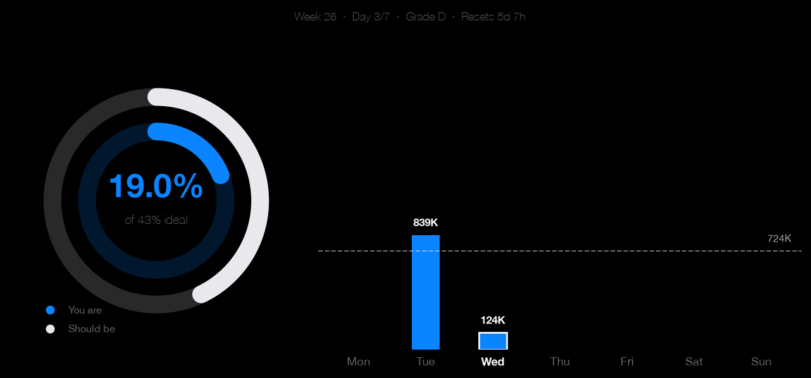
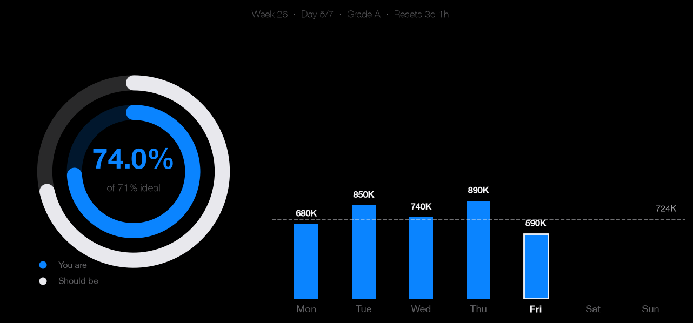

# Claude Token Tracker

Track your Claude Code weekly token usage and receive a daily Discord report before your budget resets.

## Examples

| Below pace — Day 3/7, 19% used (should be 43%) | On track — Day 5/7, 74% used (ahead of pace) |
|---|---|
|  |  |

**Discord notification (text card + chart):**
```
DAY 3/7   WEEK 26   Wed 24 Jun

STATUS       D  — well behind
USED         963K / 5.07M   (19.0%)
SHOULD BE    42.9%   (gap: 23.9 pts)
TARGET       1.03M tokens today
RESETS       Monday in 5d 7h
FORECAST     44% end of week
STREAK       1 day above pace
```

---

## Platform support

| Platform | Usage data | Scheduler |
|---|---|---|
| **macOS** | API headers + local JSONL | launchd (built-in) |
| Linux | Local JSONL only | cron (manual setup) |
| Windows | Local JSONL only | Task Scheduler (manual setup) |

macOS is the primary target. Linux and Windows support is possible with minor adaptations (see [Contributing](#contributing)).

---

## How it works

On macOS, the tracker reads the Anthropic OAuth token from the system keychain (stored there by Claude Code) and makes one minimal API call per day. The response headers include `anthropic-ratelimit-unified-7d-utilization` — the authoritative server-side signal Anthropic uses to enforce weekly limits. This covers usage from all devices and clients, not just the local machine.

Local JSONL files (`~/.claude/projects/**/*.jsonl`) are parsed separately for the daily breakdown bar chart and to auto-calibrate the weekly budget.

On non-macOS platforms the keychain step is skipped and only local JSONL is used.

---

## Requirements

- Python 3.11+
- Claude Code installed and signed in (macOS)
- A Discord server with webhook permissions

---

## Installation

```bash
git clone https://github.com/jarvis-assistant-02/claude-token-tracker
cd claude-token-tracker

python3 -m venv .venv
source .venv/bin/activate
pip install -r requirements.txt

cp .env.example .env
```

Edit `.env` and set `DISCORD_WEBHOOK_URL` (see [Discord setup](#discord-setup) below).

```bash
bash install_schedule.sh   # installs the launchd agent (macOS)
```

---

## Discord setup

1. In your Discord server go to **Settings → Integrations → Webhooks → New Webhook**
2. Assign it to a channel (e.g. `#claude-tokens`)
3. Copy the webhook URL and set it as `DISCORD_WEBHOOK_URL` in `.env`

---

## Configuration

All options are set in `.env` (copy from `.env.example`):

| Variable | Default | Description |
|---|---|---|
| `DISCORD_WEBHOOK_URL` | — | **Required.** Discord webhook URL |
| `WEEKLY_TOKEN_BUDGET` | auto | Manual budget override. Leave empty to auto-detect |
| `WEEK_START_DAY` | `0` | Week reset day (0 = Monday) |
| `WEEK_RESET_HOUR` | `9` | Local hour the week resets (Pro plan = 9 AM Lisbon / 08:00 UTC) |
| `REPORT_HOUR` | `19` | Local hour to send the daily report |

---

## Usage

```bash
source .venv/bin/activate

python daily_report.py            # parse → save snapshot → send Discord
python daily_report.py --dry-run  # parse and print stats, skip save and send
python daily_report.py --stats    # print stats only

bash install_schedule.sh          # install launchd agent
bash install_schedule.sh --uninstall
```

---

## Budget auto-detection

Budget is resolved in priority order:

1. `WEEKLY_TOKEN_BUDGET` env var
2. Inferred from `local_tokens / api_utilization` (requires macOS + Claude Code sign-in)
3. Rate-limit error recorded in the local JSONL files
4. 110% of the highest completed-week total in `data/tracker.db`
5. Fallback: 50,000,000 (Pro plan estimate)

---

## Running tests

```bash
source .venv/bin/activate
pip install -r requirements-dev.txt
pytest tests/ -v
```

Tests run automatically on every push via GitHub Actions (`.github/workflows/tests.yml`).

---

## Security

| Concern | Detail |
|---|---|
| Discord webhook URL | Stored in `.env` only — gitignored, never committed |
| Anthropic OAuth token | Read at runtime from macOS keychain, never written to disk or logged |
| Outbound requests | One daily Anthropic API call (9 tokens) and the Discord webhook POST |

---

## Contributing

Pull requests are welcome. To add Linux/Windows support the two areas that need adapting are:

- **Keychain read** (`tracker/api_usage.py`) — replace the `security` CLI call with the platform equivalent (e.g. `secret-tool` on Linux, `keyring` library cross-platform)
- **Scheduler** (`install_schedule.sh`) — add a cron or Task Scheduler equivalent for non-macOS

---

## License

MIT
